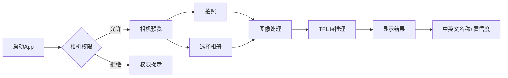

# 鱼类识别 Android App - 项目文档

> **版本**: 2.0.0  
> **最后更新**: 2026-02-01  
> **状态**: Material Design 3 UI 重构完成

---

## 📖 目录

1. [项目概述](#项目概述)
2. [技术架构](#技术架构)
3. [功能特性](#功能特性)
4. [项目结构](#项目结构)
5. [快速开始](#快速开始)
6. [UI设计系统](#ui设计系统)
7. [核心代码解析](#核心代码解析)
8. [部署指南](#部署指南)
9. [扩展开发](#扩展开发)

---

## 项目概述

本项目是一款基于 **TensorFlow Lite** 的移动端鱼类识别应用，采用 **Google Material Design 3 (Material You)** 设计风格，支持通过相机拍照或从相册选择图片进行实时鱼类识别。

### 主要特点

| 特性 | 描述 |
|------|------|
| 🎯 **智能识别** | 基于 YOLOv8 目标检测，支持 21 种常见鱼类 |
| 📷 **双模式** | 支持相机拍照和相册选择两种识别方式 |
| 🎨 **Material 3** | 采用 Google 官方最新设计语言 |
| 🌏 **双语支持** | 中英文鱼类名称映射 |
| ⚡ **快速响应** | 优化的模型推理，秒级识别速度 |

---

## 技术架构

### 技术栈

```
┌─────────────────────────────────────────────────────┐
│                    Android App                       │
├─────────────────────────────────────────────────────┤
│  展示层 (Presentation)                              │
│  ├── MainActivity.kt          主活动              │
│  ├── activity_main.xml        MD3 布局文件         │
│  └── Material 3 资源          UI组件              │
├─────────────────────────────────────────────────────┤
│  业务层 (Business)                                  │
│  ├── FishClassifier.kt        图像分类            │
│  └── ImageUtils.kt            图像处理            │
├─────────────────────────────────────────────────────┤
│  基础设施层 (Infrastructure)                        │
│  ├── CameraX                  相机控制            │
│  ├── TensorFlow Lite          AI推理引擎          │
│  └── Kotlin Coroutines        异步处理            │
└─────────────────────────────────────────────────────┘
```

### 依赖版本

| 依赖 | 版本 | 用途 |
|------|------|------|
| Kotlin | 1.9.20 | 开发语言 |
| AndroidX Core | 1.12.0 | Android 核心库 |
| CameraX | 1.3.1 | 相机功能 |
| TensorFlow Lite | 2.14.0 | AI 模型推理 |
| Material Components | 1.11.0 | Material 3 UI 组件 |
| Coroutines | 1.7.3 | 异步处理 |

### 系统要求

- **最低版本**: Android 8.0 (API 26)
- **目标版本**: Android 14 (API 34)
- **内存要求**: 2GB+ 推荐
- **权限需求**: 相机权限

---

## 功能特性

### 核心功能



### 支持的鱼类 (21种)

| 英文名 | 中文名 | 英文名 | 中文名 |
|--------|--------|--------|--------|
| Goldfish | 金鱼 | Salmon | 三文鱼 |
| Carp | 鲤鱼 | Trout | 鳟鱼 |
| Bass | 鲈鱼 | Tuna | 金枪鱼 |
| Cod | 鳕鱼 | Catfish | 鲶鱼 |
| Pike | 狗鱼 | Perch | 河鲈 |
| Tilapia | 罗非鱼 | Mackerel | 鲭鱼 |
| Snapper | 鲷鱼 | Grouper | 石斑鱼 |
| Sardine | 沙丁鱼 | Swordfish | 剑鱼 |
| Halibut | 比目鱼 | Flounder | 鲆鱼 |
| Anchovy | 鳀鱼 | Herring | 鲱鱼 |
| Eel | 鳗鱼 | | |

---

## 项目结构

```
fish-recognition-app/
├── android/                           # Android 主项目
│   ├── app/
│   │   ├── src/main/
│   │   │   ├── java/com/fishrecognition/
│   │   │   │   ├── MainActivity.kt    # 主活动
│   │   │   │   ├── FishClassifier.kt  # 分类器
│   │   │   │   ├── ImageUtils.kt      # 图像工具
│   │   │   │   └── Application.kt     # 应用类
│   │   │   ├── res/
│   │   │   │   ├── layout/            # MD3 布局文件
│   │   │   │   ├── drawable/          # Material 图标资源
│   │   │   │   └── values/            # MD3 颜色/尺寸/主题
│   │   │   └── assets/
│   │   │       ├── fish_model.tflite  # ⚠️ 需下载
│   │   │       └── labels.txt         # 鱼类标签
│   │   └── build.gradle               # 应用构建配置
│   ├── build.gradle                   # 项目构建配置
│   └── settings.gradle
├── docs/
│   └── PROJECT_DOCUMENTATION.md       # 本文档
├── model/
│   └── README.md                      # 模型说明
├── README.md                          # 项目说明
├── BUILD.md                           # 构建指南
└── QUICKSTART.md                      # 快速开始
```

---

## 快速开始

### 1. 获取模型文件

```bash
pip install ultralytics
yolo export model=yolov8n.pt format=tflite
cp yolov8n.tflite android/app/src/main/assets/fish_model.tflite
```

### 2. 在 Android Studio 中打开

1. 打开 Android Studio
2. 选择 **File → Open**
3. 选择 `fish-recognition-app/android` 目录
4. 等待 Gradle 同步完成

### 3. 运行应用

```bash
cd android
./gradlew assembleDebug
adb install app/build/outputs/apk/debug/app-debug.apk
```

或在 Android Studio 中点击 **Run** 按钮。

---

## UI设计系统

### Material Design 3 (Material You)

本项目采用 Google 官方最新设计语言:

- **现代化布局**: CoordinatorLayout + BottomAppBar + FAB
- **标准化组件**: MaterialCardView, MaterialButton, MaterialToolbar
- **统一圆角**: 4dp - 28dp 分级圆角系统
- **清晰层级**: 使用 Surface 和 Elevation 区分层级

### 配色方案

| 颜色名称 | 色值 | 用途 |
|----------|------|------|
| `md_primary` | `#1A73E8` | 主色 (Google Blue) |
| `md_on_primary` | `#FFFFFF` | 主色上文字 |
| `md_primary_container` | `#D2E3FC` | 主色容器 |
| `md_secondary` | `#5F6368` | 辅助色 (灰色) |
| `md_surface` | `#FFFFFF` | 表面色 |
| `md_on_surface` | `#1F1F1F` | 表面上文字 |
| `md_outline` | `#DADCE0` | 边框色 |

### 尺寸规范

| 尺寸名称 | 数值 | 用途 |
|----------|------|------|
| `md_corner_small` | 8dp | 小圆角 |
| `md_corner_medium` | 12dp | 中圆角 |
| `md_corner_large` | 16dp | 大圆角 |
| `md_corner_extra_large` | 28dp | 超大圆角 |
| `md_spacing_medium` | 16dp | 标准间距 |
| `md_spacing_large` | 24dp | 大间距 |

---

## 核心代码解析

### FishClassifier - 分类器核心

```kotlin
class FishClassifier(private val context: Context) {
    companion object {
        private const val MODEL_PATH = "fish_model.tflite"
        private const val LABELS_PATH = "labels.txt"
        private const val MAX_RESULTS = 5
        private const val CONFIDENCE_THRESHOLD = 0.5f
        private const val INPUT_SIZE = 640
    }

    fun setup(): Boolean { ... }
    fun detectFish(bitmap: Bitmap): List<FishDetection> { ... }
}
```

### FishDetection - 识别结果

```kotlin
data class FishDetection(
    val className: String,      // 英文类名
    val confidence: Float,      // 置信度
    val boundingBox: RectF      // 边界框
) {
    fun getChineseName(): String { ... }
    fun getConfidencePercent(): String { ... }
}
```

---

## 部署指南

### 调试版本

```bash
cd android
./gradlew assembleDebug
# APK: app/build/outputs/apk/debug/app-debug.apk
```

### 发布版本

1. 生成签名密钥：
```bash
keytool -genkey -v -keystore fish-release.keystore \
  -alias fish-key -keyalg RSA -keysize 2048 -validity 10000
```

2. 构建发布版本：
```bash
./gradlew assembleRelease
```

---

## 扩展开发

### 添加新鱼类

1. 更新 `labels.txt` 添加新标签
2. 在 `FishClassifier.kt` 中添加中英映射
3. 如需提高识别精度，重新训练模型

### 自定义训练模型

```bash
yolo detect train data=fish_data.yaml model=yolov8n.pt epochs=100
yolo export model=runs/detect/train/weights/best.pt format=tflite
```

### 后续规划

- [ ] 添加识别历史记录
- [ ] 支持分享识别结果
- [ ] 添加鱼类百科信息
- [ ] 支持多语言界面
- [ ] 添加识别结果详情页

---

## 许可证

MIT License

---

> 📧 如有问题，欢迎提交 Issue 或 Pull Request！
